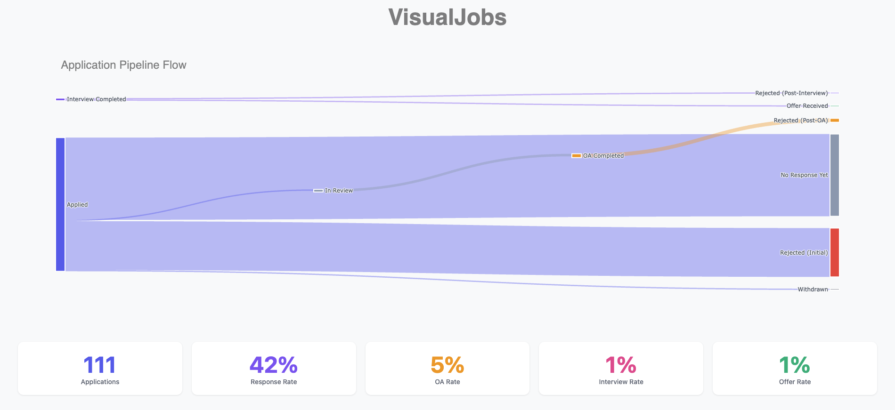

# VisualJobs

**VisualJobs** is a personal dashboard built just for fun to help visualize my job hunting process.

It pulls data from a Notion database and generates a Sankey diagram to show how applications flow through various stages — from Applied to Recruiter, Rejected, Interviews, Offers, and more. Alongside, it provides simple metrics like response rate and offer rate.

This project is not meant for production or professional use — it's just a fun way to learn Dash, Plotly, and the Notion API while reflecting on my job search.


## Project Structure

```
VisualJobs/
│
├── app.py              # Main Dash app
├── requirements.txt    # Python dependencies
├── .env                # Notion API credentials (not tracked by Git)
├── .gitignore          # Git exclusions for env, cache, and system files
├── README.md           # Project overview and usage
└── images/
    └── web.png         # Dashboard screenshot
```

## What This Is For

Job hunting can be chaotic. VisualJobs helps you:
- Record your job applications in **Notion**
- Understand where your efforts are paying off (e.g., recruiter vs. direct apply)
- Track outcomes like **offers** and **responses**
- Stay motivated with data-backed insights


## Setup Instructions

### 1. Clone the Repo

```bash
git clone https://github.com/yourusername/visualjobs.git
cd visualjobs
````

### 2. Create a Conda Environment (recommended)

```bash
conda create -n visualjobs python=3.10
conda activate visualjobs
pip install -r requirements.txt
```

### 3. Add a `.env` File

Create a `.env` file in the root with:

```dotenv
NOTION_API_KEY=secret_xxx_from_notion_integration
NOTION_DATABASE_ID=your_database_id_here
```

> ✅ Make sure your Notion integration is shared with the database!


## Run the App

```bash
python app.py
```

Then open your browser to:
📍 `http://127.0.0.1:8050`

## Example Dashboard




## 🧪 Disclaimer

This project is for **personal learning and visualization only**. It is not optimized for general use or production deployment. You're welcome to fork or adapt it for your own fun projects.


